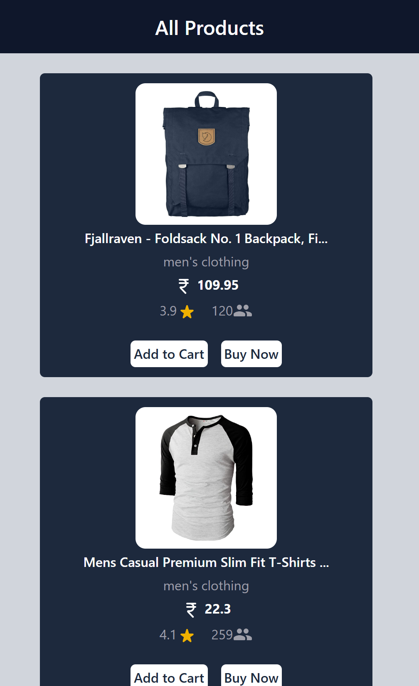

## store API
### A simple and responsive online store built using React. This project fetches product data from the FakeStoreAPI and displays it in a user-friendly and responsive UI. The website uses React's useState for state management and PropTypes to enforce correct prop types for components.

### Features
    - Responsive UI: The store page adapts to different screen sizes using media queries, ensuring a smooth shopping experience on mobile, tablet, and desktop.
    - Product Fetching: Dynamically fetches product data from the FakeStoreAPI.
    - React Functional Components: All components are written as functional components using React hooks such as useState to manage state.
    - Prop Validation: Uses PropTypes to validate props in React components to ensure proper data handling.

#### output
*In Big Screen*
.png)
*In Small Screen*
   - 

[Live Demo](https://a-store-api.netlify.app/)